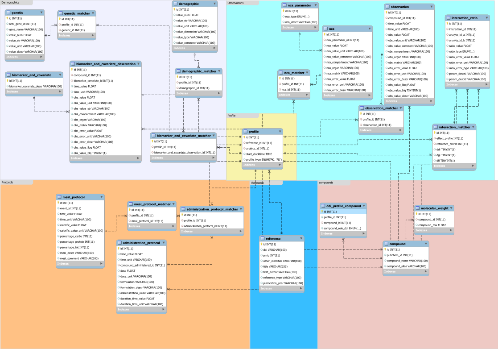

# EracoSysMed - DDGI observed data database
This is the remote repository for the EraCoSysMed DDGI observed data database.  


Schema for the database, last updated 07/14/2021.




## Running the database locally
1. Install mysql.
2. Create and run a mysql-server instance.
3. Create the database by running the script (sql/create_database.sql) in the mysql shell.

## Setting up the REST-API
1. Install node and npm.
2. In node_restapi/server/db create a folder 'config' and in it a 'config.json' and 'userdb_config.json' files.
3. The config files should be formatted as follows:
    ```json
    {
        "development": {
        "host": "host_name",
        "database": "db_name",
        "user": "user_name",
        "password": "user_password",
        "port": port, default is 3306
        }
    }
    ```
    'userdb_config.json' stores the credentials for the user database, 'config.json' for the observed_data_db.

4. Add a 'auth_config.js' file to 'config', the file should contain a secret string:
    ```javascript
        module.exports = {
            secret: "enter secret string"
        };
    ```
5. Navigate to node_restapi and run "npm run dev".
6. To test, enter "localhost:3000/api/compound" in your browser.
